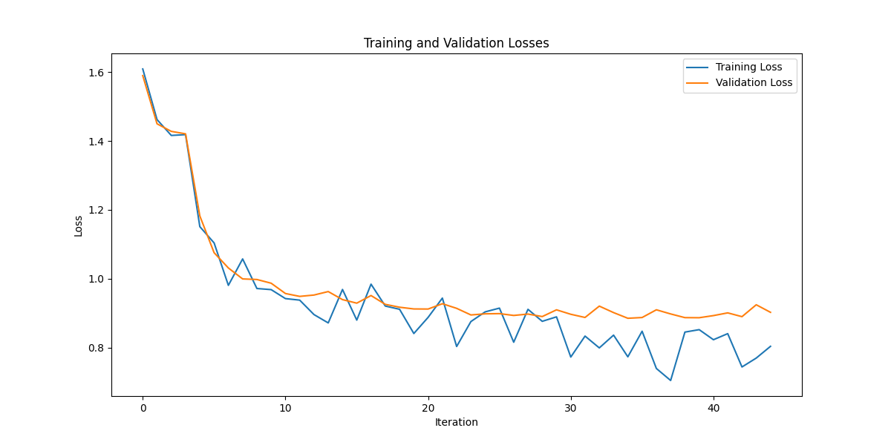

# English Text Classification
This repository contains scripts for English text classification using various models such as TextCNN, TextRNN, TextRCNN, and DPCNN. The code includes functionalities for dataset preparation, vocabulary construction, as well as model training and evaluation.

## Prerequisites

* Python 3.x
* PyTorch
* NumPy
* Pandas
* tqdm
* Gensim (for handling word embeddings)
* Other dependencies listed in requirements.txt

## Pre-training model download
`./fasttext`
[wiki-news-300d-1M.vec](https://fasttext.cc/docs/en/english-vectors.html)

`./glove`
[glove.6B.50d.txt](https://www.kaggle.com/datasets/watts2/glove6b50dtxt)

`./GoogleNews-vectors-negative300`
[GoogleNews-vectors-negative300.bin](https://www.kaggle.com/datasets/leadbest/googlenewsvectorsnegative300)

`./datasets`
[vocab.pkl](https://huggingface.co/luffycodes/TAG_mems_str_128_lr_2e5_wd_01_block_512_train_bsz_6_topk_100_lambdah_0_w103/blob/main/vocab.pkl)
[labelled_newscatcher_dataset.csv](https://www.kaggle.com/datasets/kotartemiy/topic-labeled-news-dataset)

## Project Structure
* tool.py: Utility functions for cleaning special characters and contractions.
* train_eval.py: Script for training and evaluating the models.
* run.py: run-time file (computing)
* TextRNN.py: The TextRNN model proposed in the reference paper "Recurrent Neural Network for Text Classification with Multi Task Learning"
* DPCNN.py: The DPCNN model proposed in the reference paper "Deep Pyramid Convolutional Neural Networks for Text Categorization"
* README.md: Project documentation.
## Usage
### 1 Data Preparation

1.1 Dataset Structure
* train.csv: CSV file containing training data.
* val.csv: CSV file containing validation data.
* test.csv: CSV file containing test data.

1.2 Building Vocabulary

Run the following script to build the vocabulary:

```bash
python data_split.py
python dataset_preprocessing.py
python extracting_pre-trained_word_vectors.py
```
### 2. Model Training
2.1 Configuration

Set the model and embedding type using command line arguments in the train.py script:

```bash
python train.py --model TextCNN --embedding pre_trained
```
or
```bash
python train.py --model DPCNN --embedding pre_trained
```
This example uses pre-trained word embeddings to train the TextCNN model. Adjust the parameters according to your requirements.

## Loss


## License

This project is licensed under the MIT License - see the [LICENSE](./LICENSE) file for details.